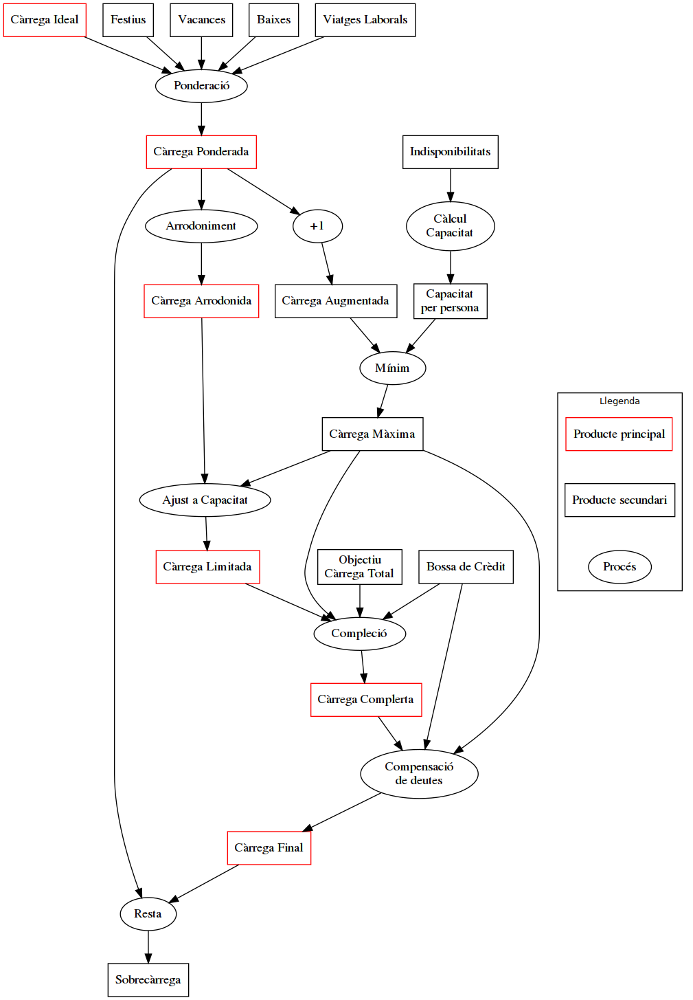

# Logica de compensació d'hores

1. **Càrrega ideal:** Es parteix de les càrregues ideals del drive

1. **Càrrega ponderada:** Aquesta carrega es ponderarà pels dies hàbils de cada persona on es tenen en compte (ideal * dies habils / 5)
    - Els dies hàbils són els que no són
        - Festius
        - Vacances
        - Baixes
        - Viatges laborals

1. **Càrrega arrodonida:** La càrrega ponderada s'arrodonirà a torns sencers.

1. **Càrrega limitada:** Es reduirà la càrrega arrodonida amb la capacitat real de cada persona degut a indisponibilitats no opcionals
    - Per saber quina es aquesta capacitat màxima cal veure cada dia com casen les indisponibilitats amb aquestes restriccions:
        1. Cada persona no pot fer més de dos torns un dia
        1. Per fer dos torns han de ser seguits bé a l'inici o bé al final del dia

1. **Càrrega complerta:** S'agafaran o es tornaran torns fins que s'arribi per dalt o per baix al total de càrrega demanat.
	Primer fent servir el deute o crèdit existent a la bossa d'hores i, si ja no es pot, generant nou deute/crèdit.
    - Què volem compensar?
        - En aquest moment, és possible estiguem per damunt o per sota dels torns necessaris
        - També és possible que hi hagi deute o crèdit de torns de graelles anteriors que calgui compensar
    - Restricccions: Les compensacions següents no es faran si superen aquests límits.
        - Limit superior: ideal + 1 per persona
        - Limit superior: Capacitat per indisponibilitats no optatives
        - Limit inferior: el nombre de torns forçats que tingui la persona (o zero)
    - Cas: Tenim més torns que necessitem. Exemple: càrrega limitada suma 125, a fer 120
        - Primer retornem els torns que sobren a les creditores de la bossa d'hores, restant crèdit
        - Si encara no arribem als 120, alliberem, considerant ja a tothom, afegint-los deute
        - Ordre: un a cada persona ordenades per credit, i amb el mateix crèdit per sobrecàrrega. Repetim fins que no poguem colocar res més.
    - Cas: Tenim menys torns que necessitem. Exemple: càrrega limitada suma 115, a fer 120
        - Primer afegim els torns que falten a les deutores de la bossa d'hores, restant dèbit
        - Si encara no arribem als 120, carreguem, considerant ja a tothom, afegint-los crèdit
        - Ordre: una a cada persona ordenades per dèbit, i amb el mateix dèbit per infracàrrega. Com el màxim de sobrecarrega es 1, no podriem repetir.

1. **Càrrega final:** Compensem deutes i crèdits que encara puguem compensar entre ells.
	- TODO: Això encara no s'ha implementat
	- Ordre: creditores per ordre de crèdit i deutores per ordre de deute i sobre/infracàrrega,
		un a cada i repetim fins que no poguem compensar ningú més d'un dels dos costats.

1. **Sobrecàrrega:** Torns que cadascú ha fet de més respecta la càrrega ponderada
    - De la càrrega final cal restar la ponderada
    - Es el que caldria sumar a la bossa d'hores de dèbit

1. **Càrrega discriminada:**
    - Un cop repartida, si estem fent discriminació, cal distribuir la càrrega en linies
    - Per agilitzar el càlcul, convé que hi hagi persones amb la càrrega a linies concretes a zero
    - Hi ha perill que linies es quedin sense possibilitat de cobrir
    - Heuristica: començar pels torns amb menys disponibilitat i començar a distribuir linies per les persones disponibles aquells torns
    

